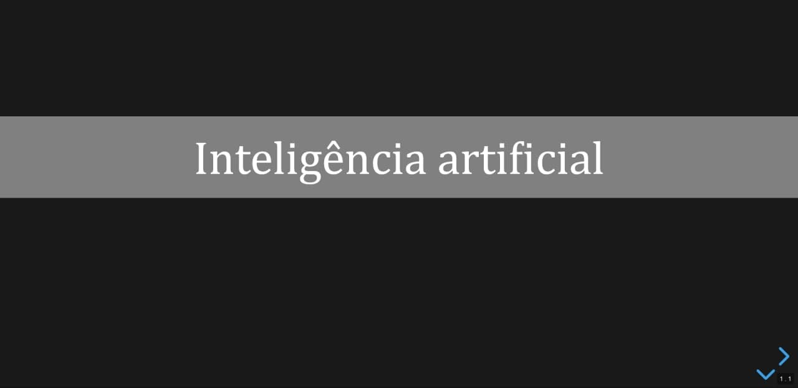
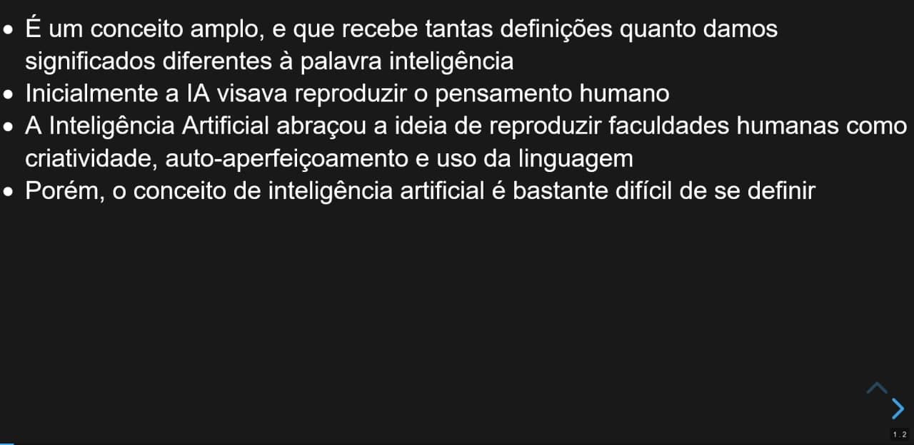

# Legbá: Projeto PIBIC 2019/2020
Aplicação desenvolvida como projeto de Iniciação Científica (PIBIC) de 2019 a 2020, orientado pelo professor Dr. Hendrik Macedo.

Consiste em um sumarizador de artigos da Wikipédia, implementado com o algoritmo de sumarização extrativa TF-IDF. Esse resumo é colocado em formato de tópicos para ser exibido em uma aplicação web.

A interface front-end é desenvolvida a partir de uma aplicação web ReactJS, em conjunto com a biblioteca RevealJS, para a apresentação de slides. Também é oferecido um endpoint, através do qual é possível obter o resumo do artigo, passando o título de um artigo da Wikipédia.
## Demonstração
Tanto a aplicação completa, quando o endpoint estão disponíveis no Heroku, respectivamente, nos endereços:

App: https://frontendnevicelabs.herokuapp.com/

Endpoint: https://backendnevicelabs.herokuapp.com/
## Execução local
Para executar a aplicação localmente, basta seguir as instruções:

1. Abra o terminal
2. Exceute os comandos:

$ pip install -r requirements.txt  
$ cd client  
$ npm install  
$ cd ..  
$ npm run 

## Screenshots
A tela inicial da aplicação

O primeiro slide após a consulta por "Inteligência artificial"

Um dos slides com o conteúdo gerado
